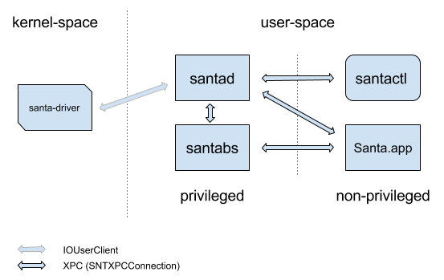

# Interprocess Communication

IPC within Santa is done mainly by way of Apple's [XPC](https://developer.apple.com/documentation/xpc?language=objc). Santa wraps [NSXPCConnection](https://developer.apple.com/documentation/foundation/nsxpcconnection?language=objc) to provide client multiplexing, signature validation of connecting clients and forced connection establishment. This is called SNTXPCConnection. Communication between santad and santa-driver (KEXT) is done with a [IOUserClient](https://developer.apple.com/documentation/kernel/iouserclient?language=objc) subclass and IOKit/IOKitLib.h functions.

##### Who starts who?

The santad and Santa (GUI) processes are both started and kept alive by launchd as LaunchDaemon and LaunchAgent respectively. This means santad runs as root, and Santa (GUI) runs as the console user. There can be multiple Santa (GUI) process running, one per logged in user.

When using a sync-server the santactl process is started by santad with a `fork()` and `exec()` of  `santactl sync —-daemon`.  Before the new process starts, all privileged are dropped. So santactl runs as nobody.

The santabs process is started by launchd by way of an XPC service connection from santad. XPC services inherit their initiator's privileges so santabs runs as root.

| Process  | Parent Process | Running User |
| -------- | -------------- | ------------ |
| santad   | launchd        | root         |
| Santa    | launchd        | user         |
| santactl | santad         | nobody       |
| santabs  | launchd        | root         |

##### Who communicates with who?

In short santad has two way communication with every other process. In addition Santa and santabs have two way communication. For other combinations, there is no direct communication.

